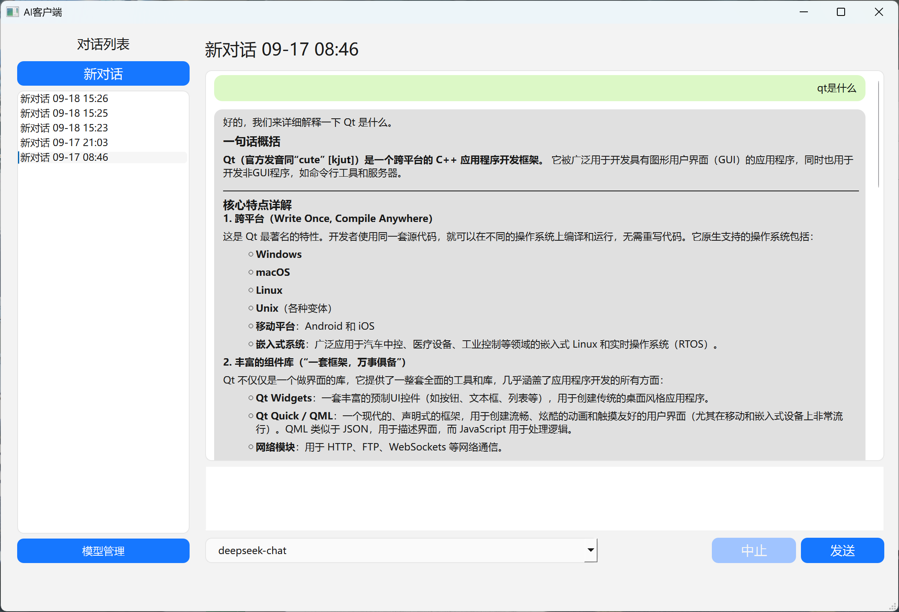
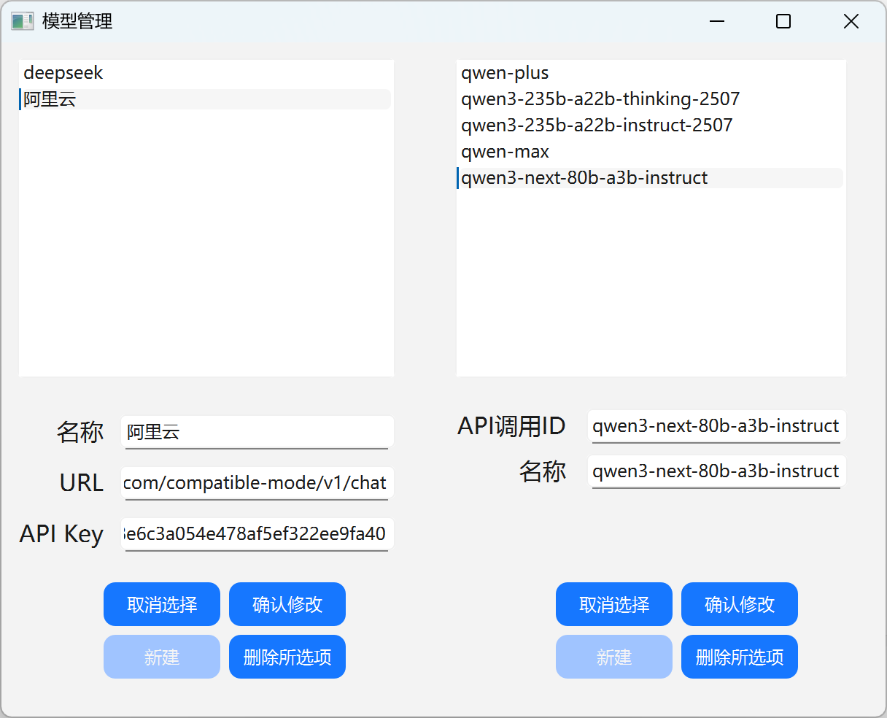

# Simple AI Client

## 简介

本项目为东南大学暑期学校程序设计课程的大作业，使用Qt 6构建。本项目支持调用OpenAI兼容API，具备上下文记忆的能力。

## 界面展示

对话界面，在对话上右键可以删除或者重命名对话。

模型管理界面。

## 项目结构

*未提及的文件没有使用*

### Model

这里是整个项目数据结构的部分。`Message`主要负责单条消息的存储；`Conversation`主要负责整段对话的存储；`ModelConfig`主要存储模型及供应商信息。

### Control

这里是整个项目数据处理的主要部分。`ConversationManager`主要负责对消息的修改；`AiRegistry`主要管理模型及供应商信息。

### Network

这里是模型的API调用部分，主要负责向服务器发送请求、流式相应内容。

### UI

这里是界面。`MainWindow`是主窗口，其中`ConversationListWidget`是界面左侧的消息列表；`ChatWidget`是界面右侧的对话窗口，每条消息基于`ChatItemWidget`构建。`modelmanagement`是点击左下角“模型管理”按钮后弹出的模型管理界面。

## 警告

**本项目中API Key明文存储，不建议日常使用！！！**

